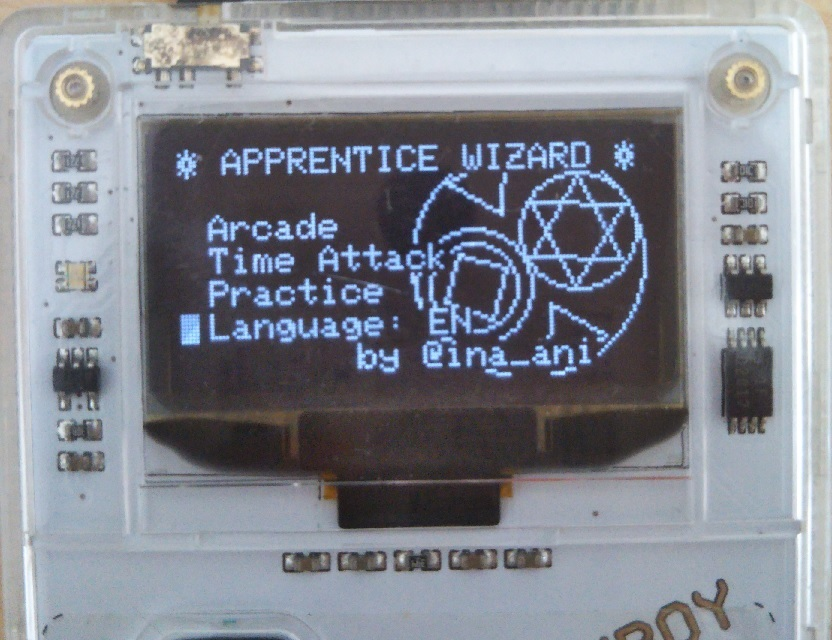
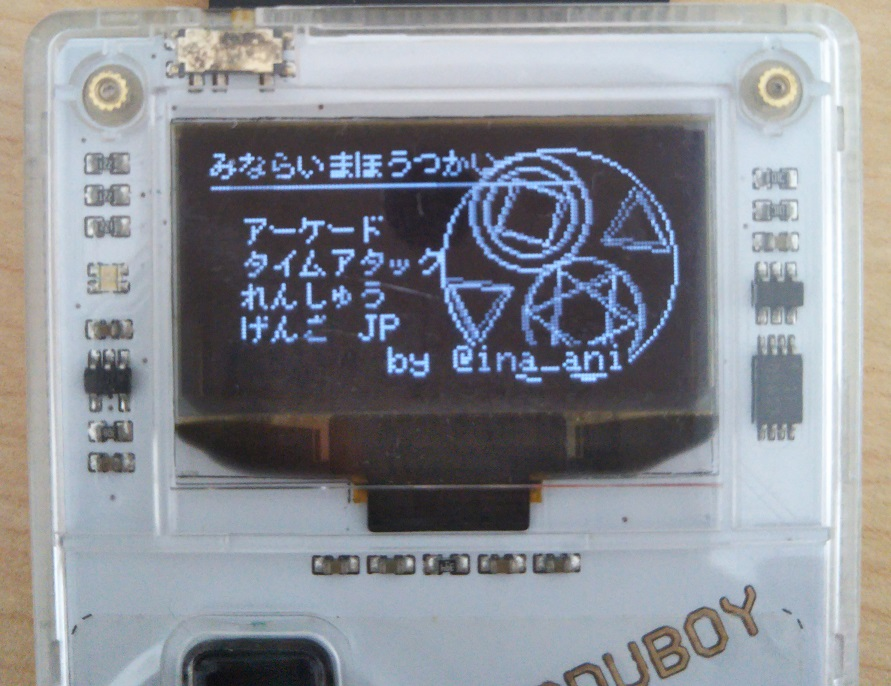
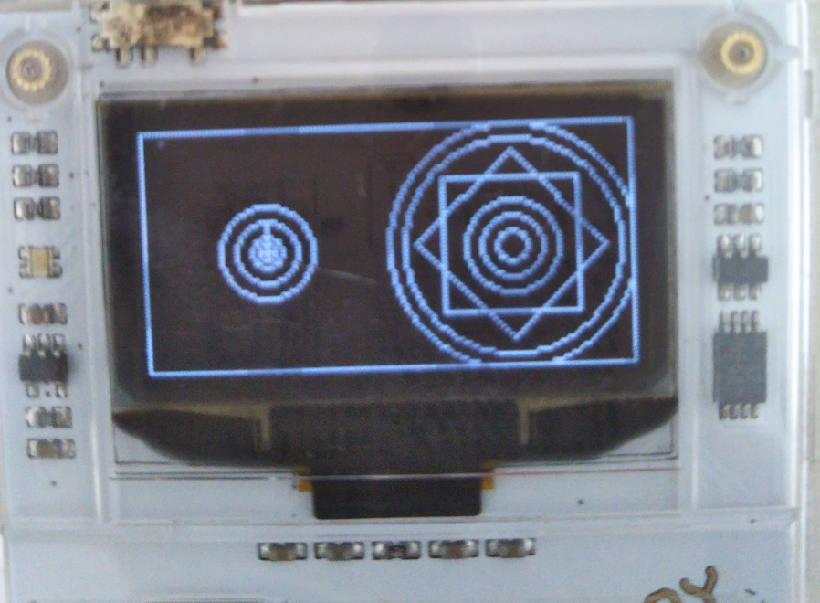

# APPRENTICE WIZARD (みならいまほうつかい)

APPRENTICE WIZARD is the game to learn the way to draw "Magical Circle".

This game is for Arduboy ( https://www.arduboy.com/ )

Support langage is English and Japanse.

---

”みならいまほうつかい”は"魔法陣"を描く方法を学ぶというゲームです。
このゲームはArduboy( https://www.arduboy.com/ )専用です。

このゲームは日本語・英語の両方に対応しています。

# Screenshot

# Thanks

- https://github.com/emutyworks/8x8DotJPFont

# Changelog

## v1.2
- Refactoring for memory usage.
- Rename Practice to Freestyle.

## v1.1

- update latest libraries
- change mode name: Practice to Sketch
- reset cursor mode in the begining of Arcade mode
